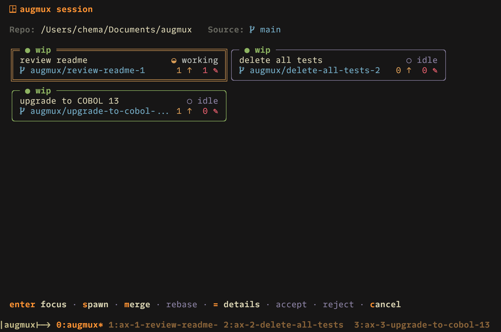

# augmux

Run multiple AI coding agents in parallel using tmux windows and git worktrees.

Each agent gets its own isolated branch and worktree, so they can work on different tasks simultaneously without stepping on each other. When they're done, you merge their work back with a two-phase review flow.



## Prerequisites

- **Go 1.26+** — to compile
- **tmux** — must be running inside a tmux session
- **git** — the project must be a git repository
- **Agent CLI** — one of the supported AI agents:
  - **Auggie** (Augment Code) — `auggie` command
  - **Cursor** (Cursor AI) — `agent` command (install via `curl https://cursor.com/install -fsS | bash`)

## Install

```bash
go install github.com/xemotrix/augmux@latest
```

Or build from source:

```bash
git clone https://github.com/xemotrix/augmux.git
cd augmux
go build -o bin/augmux .
```

## Usage

augmux is driven entirely through an interactive TUI. Run it from within a tmux session inside any git repo:

```bash
augmux
```

On first launch, you'll be prompted to pick which agent CLI to use. The choice is saved to `~/.config/augmux/config.json`.

The only other commands are:

```bash
augmux nuke    # force cleanup — discard all agents without merging
augmux help    # show help
```

## TUI

The dashboard shows a grid of agent cards with task name, branch, activity (working/idle), commits ahead, uncommitted files, and a status badge (`wip` / `merged` / `conflicts`). Borders are color-coded: green = idle with commits, yellow = working, cyan = merged, red = conflicts, gray = idle with no commits.

### Keybindings

| Key | Action |
|---|---|
| `h` `j` `k` `l` / arrows | Navigate between agent cards |
| `s` | **Spawn** — enter a task name and launch a new agent |
| `m` | **Merge** — squash-merge the selected agent into the source branch |
| `a` | **Accept** — confirm a merge and clean up the agent |
| `r` | **Reject** — undo the merge commit; agent stays alive for fixes |
| `c` | **Cancel** — discard an agent and all its changes |
| `b` | **Rebase** — send a rebase command to an agent with conflicts |
| `=` | **Details** — show a file change tree for the selected agent |
| `enter` | **Focus** — switch to the agent's tmux window |
| `q` / `ctrl+c` | Quit the TUI |

Actions are context-sensitive — they only activate when applicable to the selected agent's state (e.g. merge is only available for `wip` agents that have commits).

## How It Works

augmux manages a session tied to your current git branch (the "source branch"). Each spawned agent gets its own branch, git worktree (in `.augmux-worktrees/`), and tmux window with the agent CLI running. A rules file is injected so the agent knows its task and constraints.

**Merge flow** — squash-merge → review → accept/reject. Uncommitted changes in the worktree are auto-committed before merging. Accept tears down the agent; reject undoes the merge commit so the agent can keep working.

**Conflicts** are detected proactively via `git merge-tree`. When conflicts exist, merge is disabled and the card turns red. Press `b` to send a rebase command to the agent, or `=` to inspect which files conflict.

## Typical Workflow

```bash
tmux
cd ~/projects/myapp

# Launch the TUI
augmux

# Press 's' to spawn agents — enter task names like:
#   "add user authentication"
#   "write API tests"
#   "refactor database layer"

# The TUI shows all agents with live activity status
# Navigate with h/j/k/l, press 'enter' to jump to an agent's window

# When an agent finishes, select it and press 'm' to merge
# Review the squashed diff, then:
#   'a' to accept (looks good — clean up)
#   'r' to reject (needs fixes — agent stays alive)

# Press 'q' to quit the TUI when done
```
